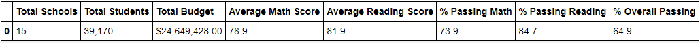

# School_District_Analysis

## Overview
the purpose of this analysis is to investigate potential academic dishonesty from Thomas High School, more specifically the ninth grade reading and math standardized grades. It is suspected that the data might have been altered, so it is up to us for this challenge to modify the data and calculate the new percentages by ignoring the data that has been suspected of manipulation.

## Results
The values that were obtained when accounting for potentially manipulated data showed a slight decrease in passing rates for math, reading, and overall. 

While this may not seem like a significant increase, one school changing it's overall values when compared to 14 other schools. A closer look can be seen in the images below.

The following image includes the value of Thomas High School with the suspected data included.

This image is the overall 15 district summary. Thomas High School has most of their scores increased by ~25%, a very significant increase.

This increase in performance puts Thomas High School among a top 5 performing school within the district.
While there were not many significant increases to overall district performance in math & reading scores by grade, scores by school spending, scores by school size, or scores by school type, the individual impact to Thomas High School was incredibly noticeable.

### Summary
By ignoring (replacing with NaN) 9th grade reading and math scores for Thomas High School, the overall performance was less than a percentage point. However, Thomas High School saw the following drastic changes:
* Math Passing percentages: 66.92% -> 93.18%
* Reading Passing percentages: 69.66% -> 97.01%
* Overall Passing percentages: 65.07% -> 90.63%
* A bottom 5 performing in the district to a top 5 performing in the district, coming second overall to Cabrera High School.
